# Table of Contents
- [MLBStats](#mlbstats)
- [Description and Usage](#description-and-usage)
  - [CalendarView](#calendarview)
  - [Detail GameView](#detail-gameview)
  - [PlayerListView](#playerlistview)
  - [DetailPlayerView](#detailplayerview)
- [Architecture and Structure](#architecture-and-structure)
- [API and Dependencies](#api-and-dependencies)
- [Issues and Unimplemented Stuff](#issues-and-unimplemented-stuff)
# MLBStats
A project that tracks baseball games over the MLB season. Key features include a calendar view with scheduled + active games, an in detail game view, player list, and player stats view. Designed for iOS 17 on iPhone 15 Pro Max.
## Description and Usage
Fun little side project for myself to follow the 2024 MLB season. </br>
There are two main views, each with a subview:
- CalendarView
    - DetailGameView
- PlayerListView
    - DetailPlayerView </br>
### CalendarView
<em>Stationary Calendar vs. Compressed Calendar</em> </br>
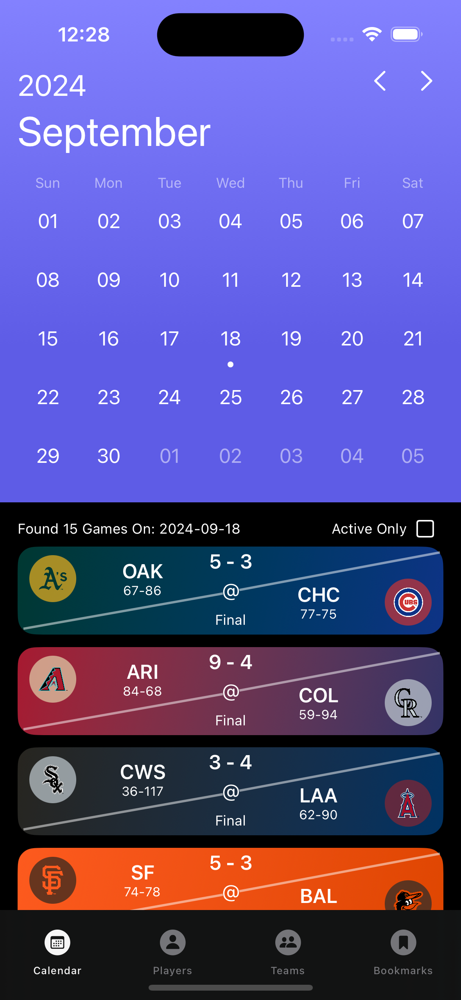
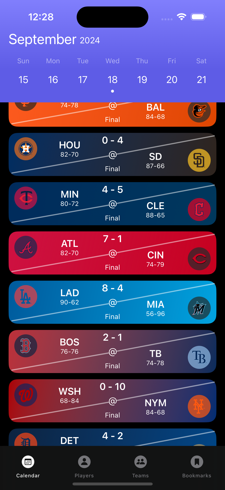 </br>
`CalendarView` shows all games scheduled on a specific date. </br>
______________________________
<em>Calendar showing scheduled games vs. showing only active games</em> </br>
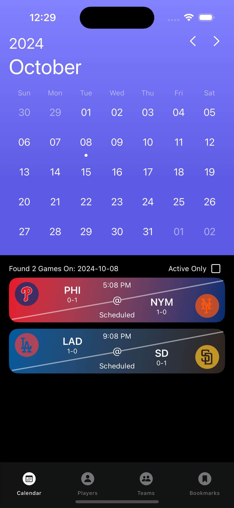
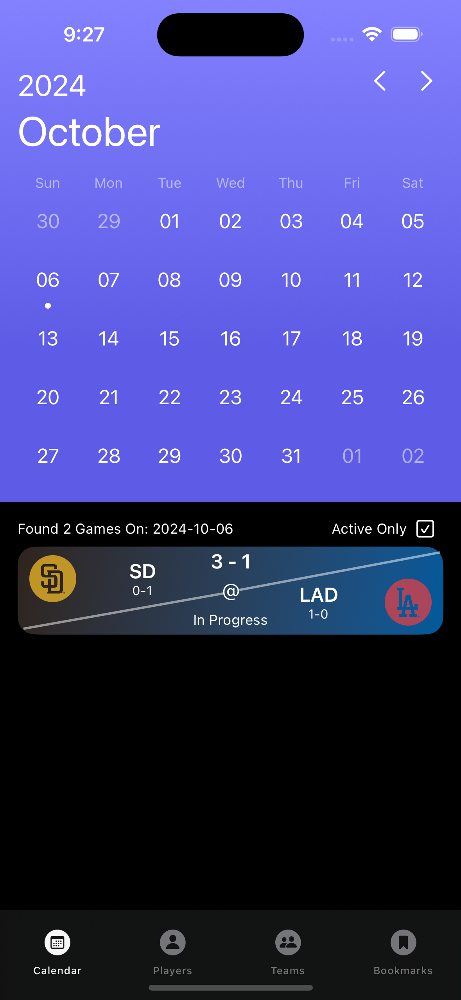 </br>
Users can toggle to show only games in progress.

### Detail GameView
<em>Active game being tracked with linescore</em> </br>
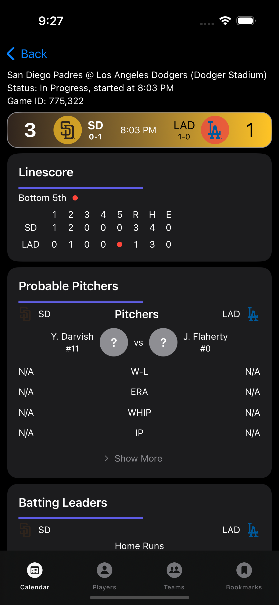 </br>
Active games update in real time, and can be identified with the red dot indicating the current inning state </br>
______________________________
<em>Linescore + Probable Pitchers, Batting Leaders + Team Stats</em> </br>
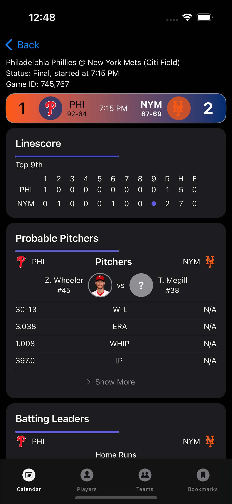
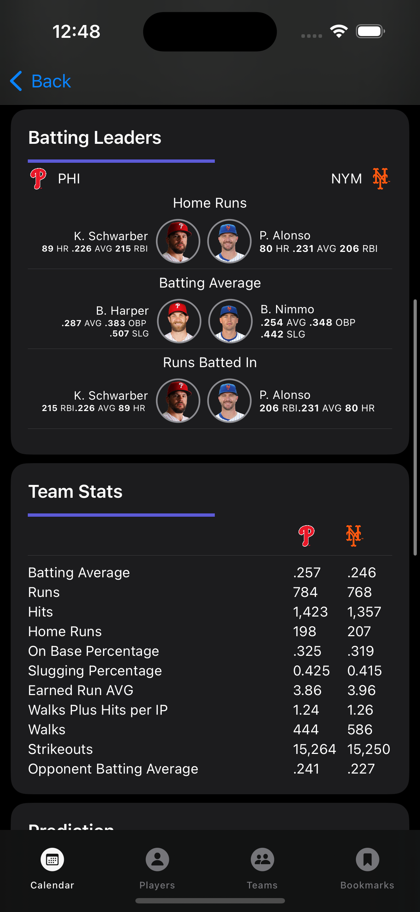 </br>
`DetailGameView` shows the score, probable pitchers, batting leaders, and team stats. </br>
______________________________
<em>Predictions (RA/5)</em> </br>
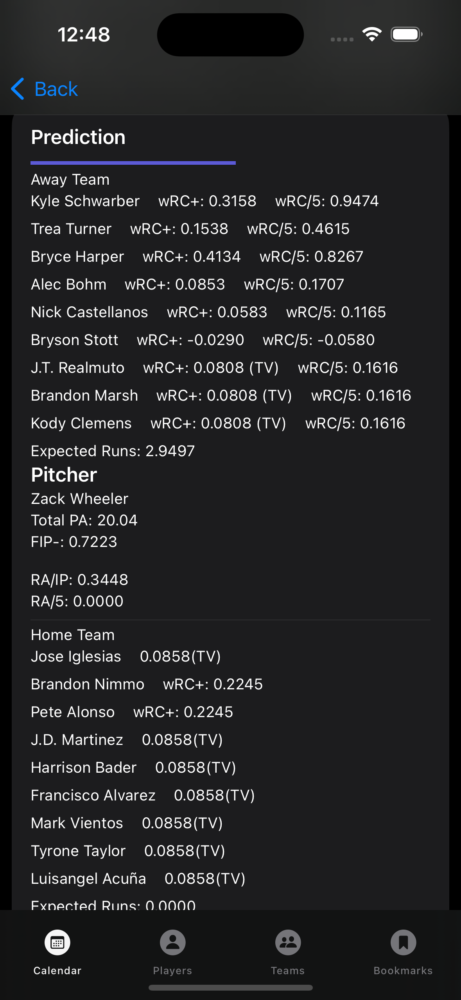
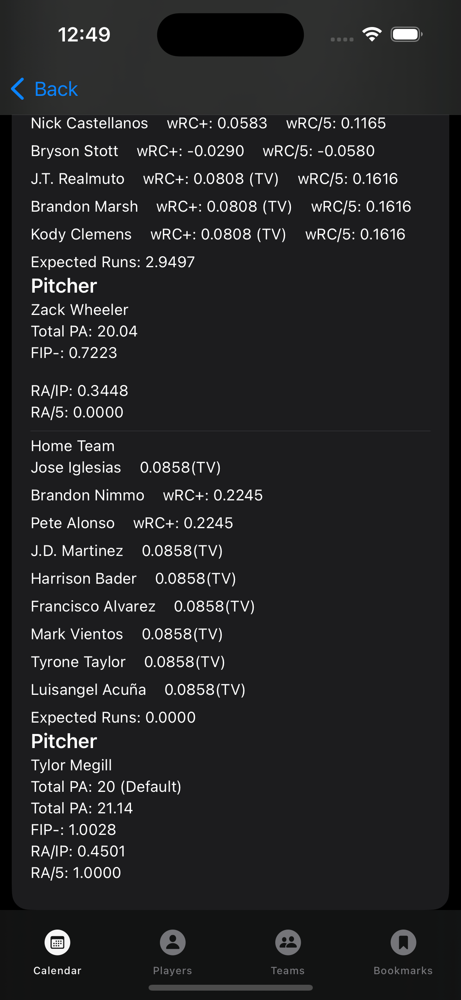 </br>
- This crude prediction system predicts the runs allowed for the first 5 innings using sabermetrics (wRC+, FIP-, etc.)
- This system of prediction at its core is very basic and flawed, look at [Issues](#issues-and-unimplemented-stuff)
    - Roughly 20% success rate from random sample of 45 games. 
        - Success defined as +/- 1 run from actual first five inning outcome
        - I have never seen a prediction over 4 runs. The vast majority (roughly 75%) of games are predicted to have <= 2 runs for the first five innings.
    - Does not take into account park factor, handedness, weather, night/day, umpire factor, and much more I wanted to look into, but got lost

### PlayerListView
<em>Player List</em> </br>
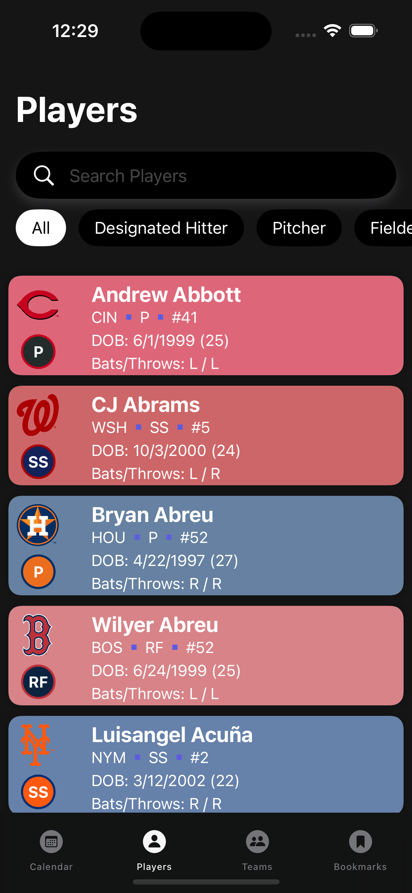 </br>
______________________________
<em>Player Search + Position Tab Bar</em> </br>
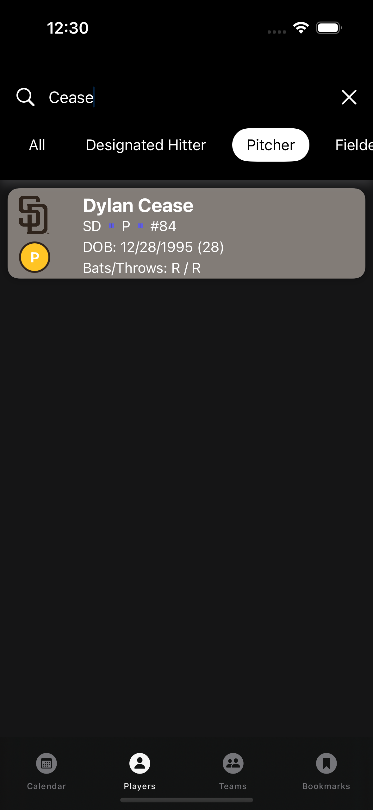
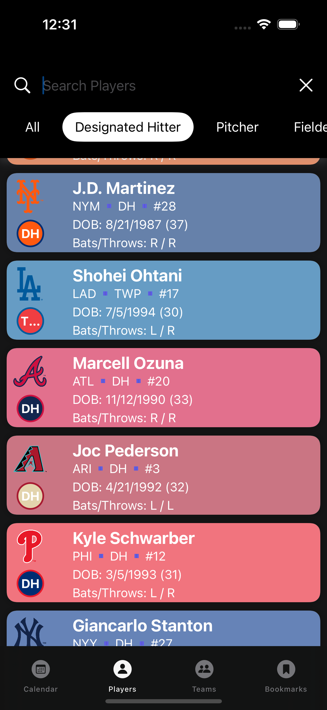 </br>
Allows users to search by name and narrow down by position </br>
______________________________
### DetailPlayerView
<em>Detail Player + Detail Player Stats</em> </br>
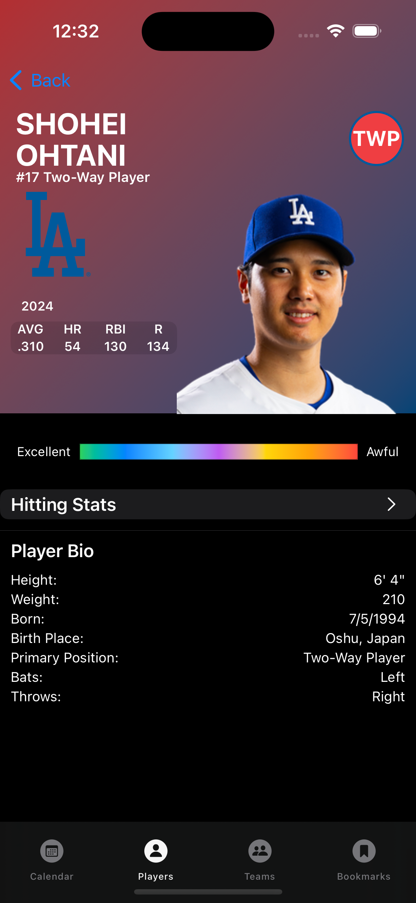
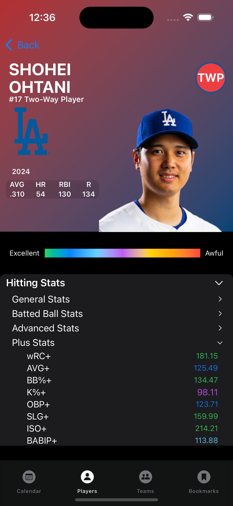 </br>
Utilizes plus stats to easily gauge player's performance compared to league-average </br>
______________________________
<em>Detail Pitcher + Catcher</em> </br>
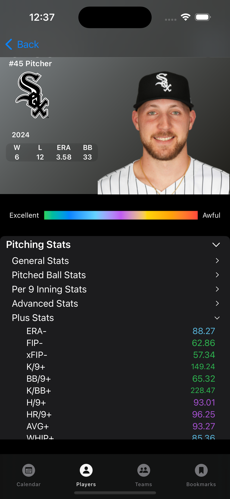
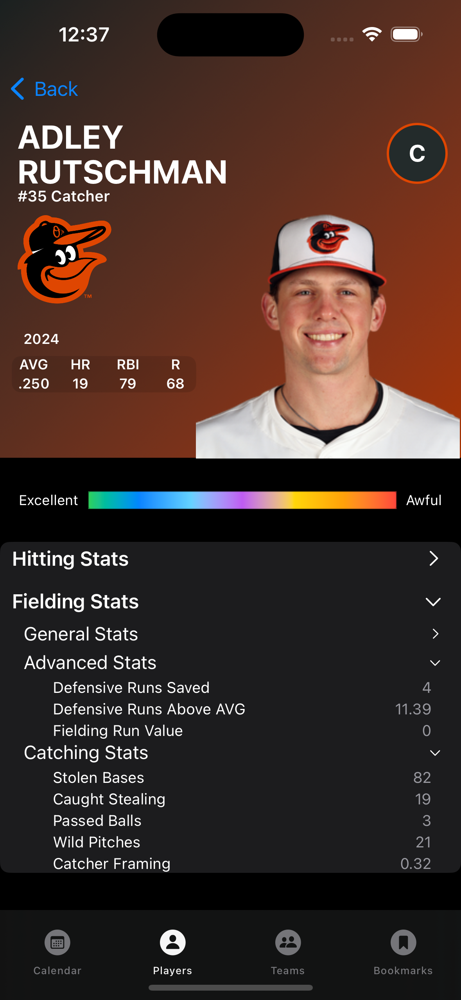 </br>
An enormous variety of advanced stats provided thanks to Fangraphs

## API and Dependencies
- All statistics and headshot images are scraped from FanGraphs MLB leaderboards (https://www.fangraphs.com/leaders/major-league).
- Schedule, Lineups, and Player Bios are pulled from MLB-StatsAPI (https://github.com/toddrob99/MLB-StatsAPI).
- Uses `SDWebImage` and `SDWebImageSVGCoder` to render team logo SVG images (https://github.com/SDWebImage/SDWebImageSVGCoder)
## Architecture and Structure
- MLBStats is implemented *mostly* using the **MVVM** architecture pattern
    - Subviews (inside Navigation Links) lack any architecture, and they are extremely unorganized
- The `Fetcher.swift` file in the `Models` directory is responsible for fetching and decoding all data  
    - Uses Swift `async` to asynchronously fetch data from Fangraphs API and MLB-StatsAPI endpoints
    - Data fetched from API endpoints are all JSON. `Fetcher` is responsible for decoding all data.
    - Key functions include `fetchPlayers()`, `fetchTeams()`, `fetchPlayerImage(for:)`, and more
    - Example:
        - The function `fetchLineupData` is called to find batting lineups, probable pitchers, and bullpens for a `gamePk` id specifier
            ```swift
            func fetchLineups(gamePk: Int) async throws -> LineupData? {
                let urlString = "https://statsapi.mlb.com/api/v1.1/game/\(gamePk)/feed/live"
                guard let url = URL(string: urlString) else {
                    print("fetchLineups: Invalid game data URL")
                    throw URLError(.badURL)
                }
                do {
                    let (data, _) = try await URLSession.shared.data(from: url)
                    let response = try JSONDecoder().decode(LiveDataResponse.self, from: data)
                    let lineupData = LineupData(
                        awayBatters: response.liveData.boxscore.teams.away.battingOrder,
                        awayStartingPitchers: response.liveData.boxscore.teams.away.pitchers,
                        awayBullpen: response.liveData.boxscore.teams.away.bullpen,
                        homeBatters: response.liveData.boxscore.teams.home.battingOrder,
                        homeStartingPitchers: response.liveData.boxscore.teams.home.pitchers,
                        homeBullpen: response.liveData.boxscore.teams.home.bullpen
                    )
                    return lineupData
                } catch {
                    print("fetchLineups: \(error)")
                    throw error
                }
                return nil
            }
            ```
- All views utilize Swift's new concurrency features (`async`, `await`, `.task`) to efficiently load data
    - Example:
        - Upon loading the `CalendarView` view, a task is created calling the view model's asynchronous `loadGames()` function:
            ```swift
            .task { 
                await viewModel.loadGames() 
            }
            ```
        - The viewmodel `CalendarViewVM` creates an instance of `Fetcher` and calls `fetchSchedule(selectedDate)` to populate the `schedule` variable:
            ```swift
            func loadGames() async {
                do {
                    self.schedule = try await fetcher.fetchSchedule(date: selectedDate)
                } catch {
                    print("loadGames: Error fetching data")
                }
            }
            ```
    - For heavy-memory usage screens, tasks are cancelled upon views disappearing
        ```swift
            // PlayerListView
            .onDisappear {
                viewModel.cancelLoadingTasks()
            }
            // PlayerListViewVM
            func cancelLoadingTasks() {
                print("Cancelling player loadData task")
                loadDataTask?.cancel()
            }
        ```
- The `Extensions.swift` file contains extensions to improve readability
    - Example:
        - An extension to format string date values
            ```swift
            extension String {
                // Formats a date like: "2024-07-08T16:35:00Z to 4:35 PM"
                func formattedGameTime() -> String {
                    let dateFormatter = DateFormatter()
                    dateFormatter.dateFormat = "yyyy-MM-dd'T'HH:mm:ssZ"
                    if let date = dateFormatter.date(from: self) {
                        dateFormatter.dateFormat = "h:mm a"
                        return dateFormatter.string(from: date)
                    }
                    return self
                }
            }
            ```
- The `TeamIDMapping.swift` file maps MLB team IDs and abbreviations between the two APIs. 
    - MLB-StatsAPI and Fangraphs API use different IDs for player and teams
    - The file also contains a hardcoded dictionary for team colors:
        - Example:
            ```swift 
            "KC": [Color(hex: "#004687"), Color(hex: "#BD9B60")], // Kansas City Royals 
            ```
- Stats are decoded into three separate categories: hitting, pitching, and fielding (which includes catching), represented in their respective files: `HittingStats.swift`, `PitchingStats.swift`, and `FieldingStats.swift`. These conform to a protocol called `IdentifiableStat`
    - `IdentifableStat` is used to generically categorize all these stat items, and to match players to their stat objects
        ```swift
        protocol IdentifiableStat: Identifiable {
            var id: Int { get }
            var teamid: Int { get }
        }
        ```
- These three identifiable stat objects are then all added to their respective `Player` object.
    - `Player`'s biography details still come from MLB-StatsAPI.
        - `Player` class:
            ```swift
            struct Player: Identifiable, Decodable {
                let id: Int                                 // 671096
                var headshotId: Int?                        // 25764 (Fangraphs)
                let fullName: String                        // Andrew Abbott
                let birthCity: String?                      // Lynchburg
                let currentTeam: Team
                struct Team: Identifiable, Decodable {
                    let id: Int                             // 113
                    let link: String                        // /api/v1/teams/113
                }
                // more bio details...

                // optional statistic objects from Fangraphs
                var hittingStats: HittingStats?
                var pitchingStats: PitchingStats?
                var fieldingStats: FieldingStats?
            }
            ```
- Matching `Player` to their `IdentifiableStat` objects in the `PlayerViewVM` view model </br>
    1. Player data and stats are fetched asynchronously:
        ```swift
        async let fetchedPlayers = fetcher.fetchPlayers()
        async let fetchedHittingStats: [HittingStats] = fetcher.fetchStats(statType: .hitting)
        async let fetchedPitchingStats: [PitchingStats] = fetcher.fetchStats(statType: .pitching)
        async let fetchedFieldingStats: [FieldingStats] = fetcher.fetchStats(statType: .fielding)
        
        let players = try await fetchedPlayers
        let hittingStats = try await fetchedHittingStats
        let pitchingStats = try await fetchedPitchingStats
        let fieldingStats = try await fetchedFieldingStats
        
        self.players = players
        let hittingStatsDictionary = dictionaryMaker.makePlayerHittingDictionary(hittingStats: hittingStats)
        let pitchingStatsDictionary = dictionaryMaker.makePlayerPitchingDictionary(pitchingStats: pitchingStats)
        let fieldingStatsDictionary = dictionaryMaker.makePlayerFieldingDictionary(fieldingStats: fieldingStats)
        ```
    2. Stats are organized into dictionaries using the `DictionaryMaker` class functions. Player `id` is used as key (`useTeamId` is for fetching team statistics, but the logic for matching teams to their stats is the same)
        ```swift
        func makeDictionary<T: IdentifiableStat>(stats: [T], useTeamId: Bool = false) -> [Int: T] {
            var dictionary = [Int: T]()
            for stat in stats {
                let key = useTeamId ? stat.teamid : stat.id
                dictionary[key] = stat
            }
            return dictionary
        }
        ```
    3. The player object is updated with the matched stats if applicable:
        ```swift
        private func updatePlayersWithStats(hittingStatsDictionary: HittingStatsDictionary, pitchingStatsDictionary: PitchingStatsDictionary, fieldingStatsDictionary: FieldingStatsDictionary) {
            players = players.map { player in
                var updatedPlayer = player
                
                // Match player with his stats
                if let hitting = hittingStatsDictionary[player.id] {
                    updatedPlayer.hittingStats = hitting
                    // Extract fangraphs id for getting headshot later
                    updatedPlayer.headshotId = hitting.playerid
                }
                
                if let pitching = pitchingStatsDictionary[player.id] {
                    updatedPlayer.pitchingStats = pitching
                    updatedPlayer.headshotId = pitching.playerid
                }
                
                if let fielding = fieldingStatsDictionary[player.id] {
                    updatedPlayer.fieldingStats = fielding
                    updatedPlayer.headshotId = fielding.playerid
                }
                
                return updatedPlayer
            }
        }
        ```
## Issues and Unimplemented Stuff
<em>Unknown Pitcher, Unknown Stats</em> </br>

 </br>
- Because predicting baseball requires a large sample size over a period of time, even notable pitchers like Jack Flaherty and Yu Darvish will not meet qualifications (something like x inning pitched over the last 3 years), resulting in the "unknown pitcher." Pitchers recovering from injury will also likely be omitted.
    - For reference, Fangraphs only deems 30 or so pitchers as "qualified" during the 2024 season. These are the most consistent, high volume pitchers that Fangraphs deems reliable for predictions.
- The same is true for batters. On the Phillies, batters like Trea Turner and Bryce Harper get far more plate appearances compared to Brandon Marsh and Kody Clemens. Those who do not meet the plate appearance minimum will use their team's average value for predictions.
    - Sometimes this results in the entire team using team values, such as the White Sox, because they receive substantially less plate appearances (because they suck). </br>
______________________________
<em>Memory Issue</em> </br>
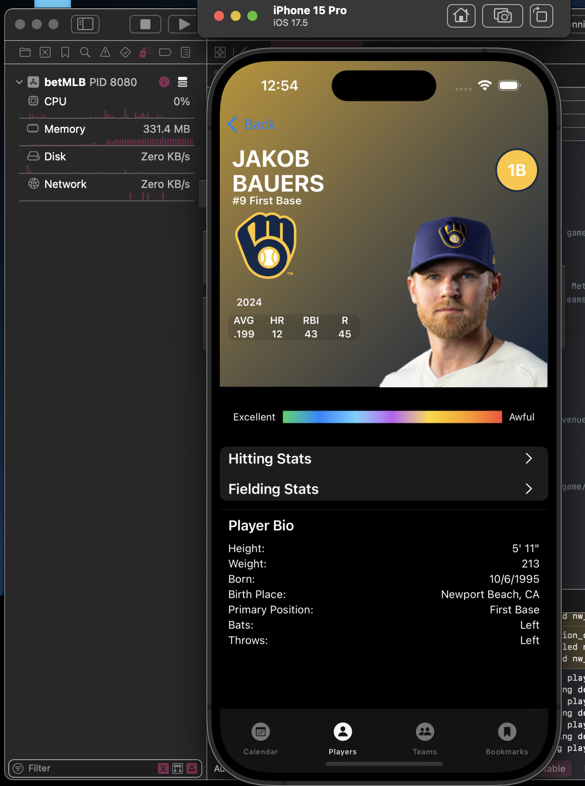 </br>
- The app will hit upwards of 325 MB usage in XCode, especially when scrolling fast up and down the `ScrollView()`
    - Maybe it's an XCode problem, but it likely can be fixed with more efficient concurrency methods such as `withTaskGroup()`, but I can't figure out how without making drastic changes, and previous fix attempts have only made memory usage worse
    - Player headshots are memory intensive, but should not be the primary problem, as they are only loaded into `DetailPlayerView`, and deinitialized when the view disappears </br>
______________________________
<em>Black Bar</em> </br>
 </br>
- Black bar below "BABIP+" and above the tab bar is always solid black. Most likely an iOS bug. Found a stackoverflow post with the same unresolved issue but lost the link.
